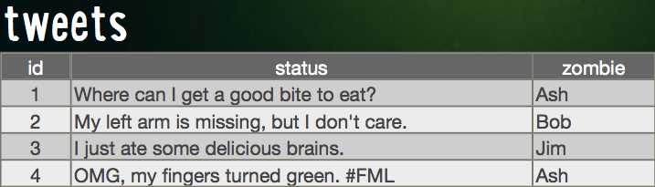

# Rails for Zombies Play through
Notes from the code school workshop rails for zombies

## Level 1 DEEP IN THE CRUD

### Syntax

* Hash

	```ruby
	b = {
		id: 3,
		status: "I ate some brains",
		zombie: "Tim"
	}
	```

	* Accessing value with keys using dot syntax

		```ruby
		b.id
			=> 3
		```

		or the alternative hash (`[:key]`) syntax

		```ruby
		b[:id]
			=> 3
		```

* (useful) print string

	```ruby
	puts b[:id]
	```

### Dealing with the database:

The zombie database structure:



#### tweets
id | status | zombie
-- | ------ | ------
1  | Where can I get a good bite to eat? | Ash
2  | My left arm is missing, but I don't care | Bob
3  | I just ate some delicious brains | Jim
4  | OMG, my fingers turned green. #FML | Ash 

* Accessing tables

zombie = Tweet.find(3)

* CREATE
	Three ways to create a new zombie tweet entry:
	
	*
	
		```ruby 
		t = Tweet.new
		t.status = "I <3 brains."
		t.save
		```
	
	*

		```ruby
		t = Tweet.new(
			status: "I <3 brains.",
			zombie: "Jim"
		)
		t.save
		``

	*

		```ruby
		Tweet.create(
			status: "I <3 brains.",
			zombie: "Jim"
		)
		``

* READ

	* find by id

		```ruby
		Tweet.find(2)
		```

	* find multiple by id

		```ruby
		Tweet.find(2, 3, 4)
		```

	* find the first, the last, find all

		```ruby
		Tweet.first
		```

		```ruby
		Tweet.last
		```

		```ruby
		Tweet.all
		```

	* count the number of entries

		```ruby
		Tweet.count
		```

	* order the found entries by a certain key

		```ruby
		Tweet.order(:zombie)
		```

	* return the first 10 entries

		```ruby
		Tweet.limit(10)
		```

	* find all entries with a certain key-value pair

		```ruby
		Tweet.where(zombie: "ash")
		```

	* chaining them together
		
		* To find the first zombie tweet by the zombie "ash":

		```ruby
		Tweet.where(zombie: "ash").first
		```

		* To find Ash's first ten tweet ordered by status:

		```ruby
		Tweet.where(zombie: "ash").order(:status).limit(10)
		```
